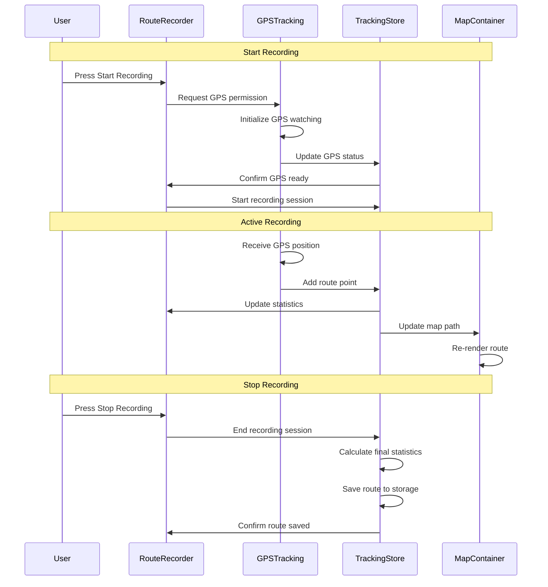

# GPS-002 Track GPS Data and Routes - Implementation Planning

## User Story

As a runner or cyclist, I want the app to record my GPS location and route during activities using my phone's GPS, so that I can see where I've been and review my route on a map.

## Pre-conditions

- User has granted location permissions to the application
- Device has GPS capability and location services enabled
- User has started an activity session
- App has access to the Geolocation API and map rendering capabilities

## Design

### Visual Layout

The GPS tracking feature will consist of several key components:
- **Live Map View**: Real-time map display showing current location and route path
- **Activity Controls**: Start/pause/stop recording buttons with clear visual states
- **Route Statistics Panel**: Distance, duration, and pace information
- **Route History View**: List and detailed view of previously recorded routes
- **Map Layers**: Toggle between different map styles (satellite, terrain, standard)

### Color and Typography

- **Background Colors**: 
  - Primary: bg-white dark:bg-gray-900
  - Map container: bg-gray-100 dark:bg-gray-800
  - Active recording: bg-green-50 dark:bg-green-900/20
  - Paused state: bg-yellow-50 dark:bg-yellow-900/20

- **Typography**:
  - Route stats: font-mono text-2xl font-bold text-gray-900 dark:text-white
  - Map controls: font-inter text-sm font-medium text-gray-700 dark:text-gray-300
  - Activity labels: font-inter text-xs uppercase tracking-wide text-gray-500

- **Component-Specific**:
  - Active route path: stroke-blue-500 stroke-width-4
  - Current location marker: bg-blue-600 border-white shadow-lg
  - Control buttons: bg-green-500 hover:bg-green-600 text-white
  - Pause button: bg-yellow-500 hover:bg-yellow-600 text-white
  - Stop button: bg-red-500 hover:bg-red-600 text-white

### Interaction Patterns

- **Map Interaction**: 
  - Pinch to zoom, drag to pan
  - Double-tap to center on current location
  - Long press to add waypoints
  - Smooth animations for location updates (300ms ease)

- **Recording Controls**:
  - Start: Immediate GPS acquisition with loading state
  - Pause: Maintains current location, stops path recording
  - Resume: Continues from last known location
  - Stop: Saves route and shows summary
  - Haptic feedback for control interactions

### Measurements and Spacing

- **Map Container**:
  ```
  h-96 md:h-[500px] lg:h-[600px] w-full rounded-lg overflow-hidden
  ```

- **Control Panel**:
  ```
  - Bottom overlay: absolute bottom-4 left-4 right-4
  - Button spacing: space-x-4
  - Panel padding: p-4 bg-white/90 backdrop-blur-sm rounded-xl
  ```

- **Statistics Display**:
  ```
  - Grid layout: grid-cols-3 gap-4
  - Stat cards: p-3 bg-gray-50 rounded-lg
  - Values: text-2xl font-bold
  - Labels: text-xs mt-1
  ```

### Responsive Behavior

- **Desktop (lg: 1024px+)**:
  ```
  - Side-by-side layout: map (2/3) + stats panel (1/3)
  - Full-featured control panel
  - Route history sidebar
  ```

- **Tablet (md: 768px - 1023px)**:
  ```
  - Stacked layout: map on top, controls below
  - Compact stats in horizontal scroll
  - Modal route history
  ```

- **Mobile (sm: < 768px)**:
  ```
  - Full-screen map with overlay controls
  - Bottom sheet for stats and history
  - Swipe gestures for quick actions
  ```

## Technical Requirements

### Component Structure

```
src/app/tracking/
├── page.tsx                          # Main GPS tracking page
└── _components/
    ├── MapContainer.tsx               # Map rendering and GPS visualization
    ├── RouteRecorder.tsx              # GPS tracking logic and controls
    ├── ActivityControls.tsx           # Start/pause/stop recording controls
    ├── RouteStats.tsx                 # Real-time statistics display
    ├── RouteHistory.tsx               # Previously recorded routes list
    ├── RouteDetails.tsx               # Individual route details view
    └── hooks/
        ├── useGPSTracking.ts          # GPS location tracking hook
        ├── useRouteRecording.ts       # Route recording state management
        └── useMapControls.ts          # Map interaction and controls
```

### Required Components

- MapContainer ⬜
- RouteRecorder ⬜
- ActivityControls ⬜
- RouteStats ⬜
- RouteHistory ⬜
- RouteDetails ⬜
- useGPSTracking ⬜
- useRouteRecording ⬜
- useMapControls ⬜

### State Management Requirements

```typescript
interface GPSPosition {
  latitude: number;
  longitude: number;
  altitude?: number;
  accuracy: number;
  timestamp: number;
}

interface RoutePoint extends GPSPosition {
  speed?: number;
  heading?: number;
}

interface Route {
  id: string;
  name?: string;
  startTime: Date;
  endTime?: Date;
  points: RoutePoint[];
  distance: number;
  duration: number;
  averageSpeed: number;
  activityType: 'running' | 'cycling' | 'walking';
}

interface TrackingState {
  // Recording States
  isRecording: boolean;
  isPaused: boolean;
  isGPSEnabled: boolean;
  
  // Current Session
  currentRoute: Route | null;
  currentPosition: GPSPosition | null;
  recordedPoints: RoutePoint[];
  
  // Statistics
  currentDistance: number;
  currentDuration: number;
  currentSpeed: number;
  
  // Route History
  savedRoutes: Route[];
  selectedRoute: Route | null;
  
  // UI States
  mapCenter: [number, number];
  mapZoom: number;
  followUser: boolean;
}

// State Actions
const actions = {
  startRecording: () => void;
  pauseRecording: () => void;
  resumeRecording: () => void;
  stopRecording: () => void;
  updatePosition: (position: GPSPosition) => void;
  saveRoute: (route: Route) => void;
  loadRoutes: () => void;
  selectRoute: (routeId: string) => void;
  setMapView: (center: [number, number], zoom: number) => void;
  toggleFollowUser: () => void;
}
```

## Acceptance Criteria

### Layout & Content

1. Map Display
   ```
   - Interactive map component with smooth rendering
   - Real-time current location indicator
   - Route path visualization with clear line styling
   - Map controls (zoom, center, layer selection)
   - Responsive design across all device sizes
   ```

2. Recording Interface
   ```
   - Prominent start/pause/stop controls
   - Clear visual feedback for recording state
   - GPS signal strength indicator
   - Battery optimization notices
   ```

3. Statistics Panel
   ```
   - Real-time distance tracking
   - Duration timer with precision
   - Current and average speed display
   - Elevation data (if available)
   ```

### Functionality

1. GPS Tracking Core

   - [ ] Request and handle location permissions
   - [ ] Initialize GPS with appropriate accuracy settings
   - [ ] Record GPS coordinates at regular intervals (1-5 seconds)
   - [ ] Handle GPS signal loss gracefully
   - [ ] Optimize battery usage during tracking

2. Route Recording

   - [ ] Start new route recording session
   - [ ] Pause and resume recording functionality
   - [ ] Stop recording and save route data
   - [ ] Calculate route statistics (distance, duration, speed)
   - [ ] Handle edge cases (no GPS, poor signal)

3. Map Visualization
   - [ ] Display interactive map with user's current location
   - [ ] Render route path in real-time during recording
   - [ ] Show recorded routes on map view
   - [ ] Provide map controls (zoom, pan, center)
   - [ ] Support multiple map tile providers

### Navigation Rules

- Recording can only start when GPS signal is acquired
- Users must confirm before stopping an active recording
- Route data is automatically saved when recording stops
- Map always centers on user location when recording starts
- Previous routes can be overlayed on current map view

### Error Handling

- GPS permission denied: Show permission request with explanation
- GPS signal unavailable: Display appropriate message and retry mechanism
- Poor GPS accuracy: Warn user and suggest moving to open area
- Storage failures: Implement local backup and retry mechanisms

## Modified Files

```
src/app/tracking/
├── page.tsx ⬜
└── _components/
    ├── MapContainer.tsx ⬜
    ├── RouteRecorder.tsx ⬜
    ├── ActivityControls.tsx ⬜
    ├── RouteStats.tsx ⬜
    ├── RouteHistory.tsx ⬜
    ├── RouteDetails.tsx ⬜
    └── hooks/
        ├── useGPSTracking.ts ⬜
        ├── useRouteRecording.ts ⬜
        └── useMapControls.ts ⬜
├── store/
│   └── trackingStore.ts ⬜
└── types/
    └── gps.ts ⬜
```

## Status

🟨 IN PROGRESS

1. Setup & Configuration

   - [ ] Install required mapping library (React Leaflet or Mapbox)
   - [ ] Configure GPS permissions and geolocation API
   - [ ] Setup local storage for route data persistence
   - [ ] Create TypeScript interfaces for GPS and route data

2. Layout Implementation

   - [ ] Create responsive map container component
   - [ ] Implement activity control panel layout
   - [ ] Design route statistics display components
   - [ ] Build route history list and detail views

3. GPS Tracking Implementation

   - [ ] Implement GPS position tracking hook
   - [ ] Create route recording state management
   - [ ] Build real-time location updates
   - [ ] Add GPS accuracy and signal monitoring

4. Map Integration

   - [ ] Setup interactive map component
   - [ ] Implement real-time route path rendering
   - [ ] Add current location marker and tracking
   - [ ] Create map controls and user interactions

5. Data Persistence

   - [ ] Implement route saving to local storage
   - [ ] Create route loading and history management
   - [ ] Add route export capabilities (GPX/KML)
   - [ ] Build route statistics calculations

6. Testing
   - [ ] Unit tests for GPS tracking hooks
   - [ ] Integration tests for route recording
   - [ ] GPS simulation for testing environments
   - [ ] Cross-device compatibility testing

## Dependencies

- React Leaflet or Mapbox GL JS for map rendering
- Browser Geolocation API for GPS access
- Local storage for route data persistence
- Permission handling for location access

## Related Stories

- GPS-001 (Core app infrastructure)
- GPS-003 (Heart rate integration with GPS data)
- GPS-004 (Auto-pause functionality during GPS tracking)

## Notes

### Technical Considerations

1. **Battery Optimization**: Implement intelligent GPS sampling rates based on activity type and device capabilities
2. **Offline Capability**: Consider offline map tiles for areas with poor connectivity
3. **Accuracy Filtering**: Filter out GPS points with poor accuracy to improve route quality
4. **Performance**: Optimize map rendering for smooth real-time updates
5. **Privacy**: Ensure GPS data is stored locally by default with clear consent for any cloud sync

### Business Requirements

- GPS tracking must work without internet connectivity
- Route data should be exportable in standard formats (GPX, KML)
- Battery usage should be optimized for long activities
- User privacy and data control must be prioritized

### API Integration

#### Type Definitions

```typescript
interface GPSCoordinates {
  latitude: number;
  longitude: number;
  altitude?: number;
  accuracy: number;
  altitudeAccuracy?: number;
  heading?: number;
  speed?: number;
}

interface GeolocationPosition {
  coords: GPSCoordinates;
  timestamp: number;
}

interface RouteSegment {
  startPoint: RoutePoint;
  endPoint: RoutePoint;
  distance: number;
  duration: number;
  averageSpeed: number;
}

interface TrackingConfig {
  enableHighAccuracy: boolean;
  timeout: number;
  maximumAge: number;
  distanceFilter: number;
  updateInterval: number;
}

interface RouteExport {
  format: 'gpx' | 'kml' | 'json';
  route: Route;
  metadata: {
    exportDate: Date;
    appVersion: string;
    deviceInfo: string;
  };
}
```

### Mock Implementation

#### Mock Server Configuration

```typescript
// filepath: mocks/stub.ts
const mocks = [
  {
    endPoint: '/api/gps/simulate',
    json: 'gps-simulation.json',
  },
  {
    endPoint: '/api/routes',
    json: 'saved-routes.json',
  },
];
```

#### Mock Response

```json
// filepath: mocks/responses/gps-simulation.json
{
  "status": "SUCCESS",
  "data": {
    "simulatedRoute": [
      {
        "latitude": 37.7749,
        "longitude": -122.4194,
        "altitude": 52,
        "accuracy": 5,
        "timestamp": 1696118400000,
        "speed": 3.5
      },
      {
        "latitude": 37.7750,
        "longitude": -122.4195,
        "altitude": 53,
        "accuracy": 4,
        "timestamp": 1696118405000,
        "speed": 3.8
      }
    ]
  }
}
```

### State Management Flow



### Custom Hook Implementation

```typescript
const useGPSTracking = () => {
  const [position, setPosition] = useState<GeolocationPosition | null>(null);
  const [error, setError] = useState<string | null>(null);
  const [isWatching, setIsWatching] = useState(false);
  const watchId = useRef<number | null>(null);

  const startWatching = useCallback((config: TrackingConfig) => {
    if (!navigator.geolocation) {
      setError('Geolocation is not supported by this browser');
      return;
    }

    const options: PositionOptions = {
      enableHighAccuracy: config.enableHighAccuracy,
      timeout: config.timeout,
      maximumAge: config.maximumAge,
    };

    const successCallback = (position: GeolocationPosition) => {
      setPosition(position);
      setError(null);
    };

    const errorCallback = (error: GeolocationPositionError) => {
      switch (error.code) {
        case error.PERMISSION_DENIED:
          setError('GPS permission denied by user');
          break;
        case error.POSITION_UNAVAILABLE:
          setError('GPS position unavailable');
          break;
        case error.TIMEOUT:
          setError('GPS request timed out');
          break;
        default:
          setError('Unknown GPS error occurred');
          break;
      }
    };

    watchId.current = navigator.geolocation.watchPosition(
      successCallback,
      errorCallback,
      options
    );
    
    setIsWatching(true);
  }, []);

  const stopWatching = useCallback(() => {
    if (watchId.current !== null) {
      navigator.geolocation.clearWatch(watchId.current);
      watchId.current = null;
      setIsWatching(false);
    }
  }, []);

  useEffect(() => {
    return () => {
      stopWatching();
    };
  }, [stopWatching]);

  return {
    position,
    error,
    isWatching,
    startWatching,
    stopWatching,
  };
};

const useRouteRecording = () => {
  const store = useTrackingStore();
  const { position, startWatching, stopWatching } = useGPSTracking();

  useEffect(() => {
    if (store.isRecording && position) {
      const routePoint: RoutePoint = {
        latitude: position.coords.latitude,
        longitude: position.coords.longitude,
        altitude: position.coords.altitude,
        accuracy: position.coords.accuracy,
        speed: position.coords.speed,
        heading: position.coords.heading,
        timestamp: position.timestamp,
      };

      store.addRoutePoint(routePoint);
    }
  }, [position, store.isRecording]);

  const startRecording = useCallback(() => {
    const config: TrackingConfig = {
      enableHighAccuracy: true,
      timeout: 10000,
      maximumAge: 5000,
      distanceFilter: 5,
      updateInterval: 2000,
    };

    startWatching(config);
    store.startRecording();
  }, [startWatching, store]);

  const stopRecording = useCallback(() => {
    stopWatching();
    store.stopRecording();
  }, [stopWatching, store]);

  return {
    startRecording,
    stopRecording,
    pauseRecording: store.pauseRecording,
    resumeRecording: store.resumeRecording,
    isRecording: store.isRecording,
    isPaused: store.isPaused,
    currentRoute: store.currentRoute,
  };
};
```

## Testing Requirements

### Integration Tests (Target: 80% Coverage)

1. GPS Tracking Tests

```typescript
describe('GPS Tracking', () => {
  it('should request location permission on first use', async () => {
    // Test permission request flow
  });

  it('should start recording GPS points when recording begins', async () => {
    // Test GPS coordinate capture
  });

  it('should handle GPS signal loss gracefully', async () => {
    // Test error handling
  });

  it('should calculate accurate distance between points', async () => {
    // Test distance calculation
  });
});
```

2. Route Recording Tests

```typescript
describe('Route Recording', () => {
  it('should create new route when recording starts', async () => {
    // Test route creation
  });

  it('should pause and resume recording correctly', async () => {
    // Test pause/resume functionality
  });

  it('should save route data when recording stops', async () => {
    // Test route persistence
  });

  it('should calculate route statistics accurately', async () => {
    // Test statistics computation
  });
});
```

3. Map Integration Tests

```typescript
describe('Map Integration', () => {
  it('should display current location on map', async () => {
    // Test location marker
  });

  it('should render route path in real-time', async () => {
    // Test path rendering
  });

  it('should handle map interactions correctly', async () => {
    // Test zoom, pan, center functionality
  });
});
```

### Performance Tests

1. GPS Performance

```typescript
describe('GPS Performance', () => {
  it('should maintain acceptable battery usage during long recordings', async () => {
    // Test power efficiency
  });

  it('should handle high-frequency GPS updates smoothly', async () => {
    // Test performance under load
  });
});
```

2. Map Performance

```typescript
describe('Map Performance', () => {
  it('should render route paths efficiently with many points', async () => {
    // Test rendering performance
  });

  it('should handle map updates without blocking UI', async () => {
    // Test smooth map interactions
  });
});
```

### Test Environment Setup

```typescript
// Test helper functions
const mockGeolocation = () => {
  const mockGeolocation = {
    getCurrentPosition: jest.fn(),
    watchPosition: jest.fn(),
    clearWatch: jest.fn(),
  };
  
  Object.defineProperty(global.navigator, 'geolocation', {
    value: mockGeolocation,
    writable: true,
  });
  
  return mockGeolocation;
};

const simulateGPSPosition = (lat: number, lng: number, accuracy = 5) => {
  return {
    coords: {
      latitude: lat,
      longitude: lng,
      accuracy: accuracy,
      altitude: null,
      altitudeAccuracy: null,
      heading: null,
      speed: null,
    },
    timestamp: Date.now(),
  };
};

const simulateRoute = (startLat: number, startLng: number, points: number) => {
  const route = [];
  for (let i = 0; i < points; i++) {
    route.push(simulateGPSPosition(
      startLat + (i * 0.0001),
      startLng + (i * 0.0001)
    ));
  }
  return route;
};

beforeEach(() => {
  mockGeolocation();
});
```

### Accessibility Tests

```typescript
describe('Accessibility', () => {
  it('should provide appropriate ARIA labels for map controls', async () => {
    // Test screen reader compatibility
  });

  it('should support keyboard navigation for all controls', async () => {
    // Test keyboard accessibility
  });

  it('should announce recording state changes to screen readers', async () => {
    // Test dynamic content announcements
  });
});
```

## Feature Documentation

This implementation plan provides a comprehensive foundation for building GPS tracking and route recording functionality. The feature will enable users to record their activities with accurate GPS data, visualize their routes on an interactive map, and maintain a history of their recorded activities.

Key implementation priorities:
1. Robust GPS tracking with proper error handling
2. Smooth real-time map visualization
3. Efficient route data storage and retrieval
4. Battery-optimized recording for long activities
5. Responsive design across all device types

The modular component structure ensures maintainability and extensibility for future GPS-related features like route sharing, route planning, and advanced analytics.