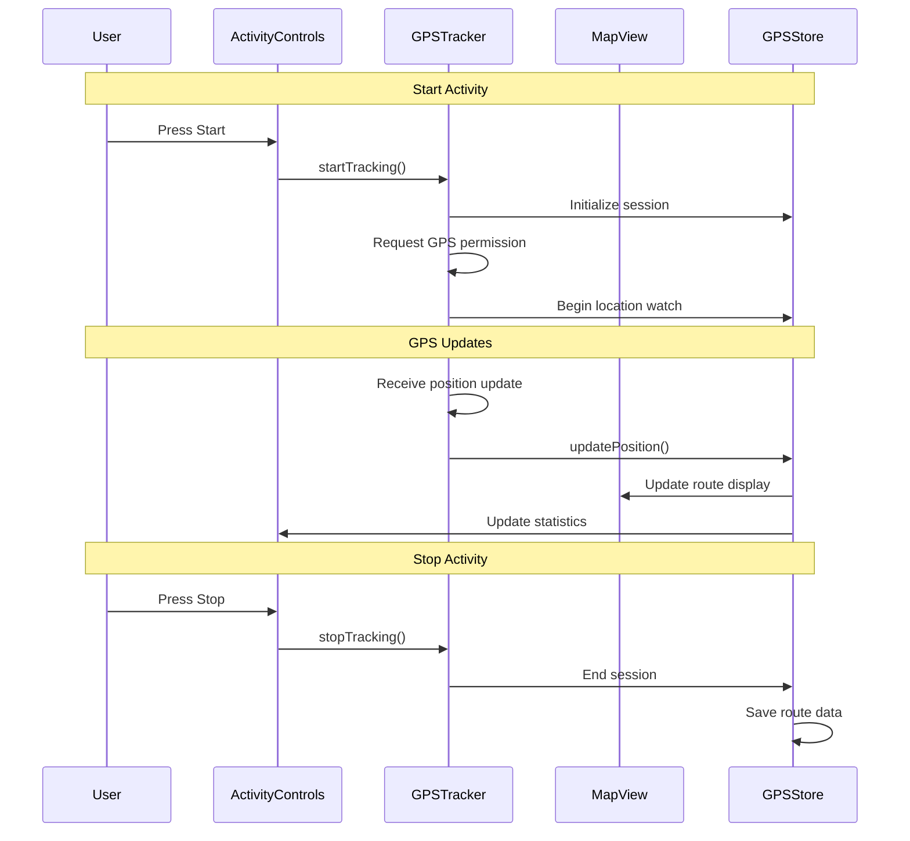

# GPS-002 Track GPS Data and Routes - Implementation Planning

## User Story

As a runner or cyclist, I want the app to record my GPS location and route during activities using my phone's GPS, so that I can see where I've been and review my route on a map.

## Pre-conditions

- User has granted location permissions to the app
- Device has GPS capability and is enabled
- User has started an activity session
- App has access to browser's Geolocation API

## Design

### Visual Layout

The GPS tracking feature includes:
- Real-time map display during activity
- Route visualization with path overlay
- Current location marker
- Activity controls (start/pause/stop)
- Map controls (zoom, center, map type)
- Route statistics overlay (distance, current pace)

### Color and Typography

- **Background Colors**: 
  - Map container: bg-gray-100 dark:bg-gray-800
  - Controls overlay: bg-white/90 dark:bg-gray-900/90 backdrop-blur-sm
  - Route path: stroke-blue-500 with opacity-80

- **Typography**:
  - Stats overlay: font-inter text-lg font-semibold text-gray-900 dark:text-white
  - Control labels: font-inter text-sm text-gray-600 dark:text-gray-300
  - Distance/pace: font-mono text-xl font-bold text-blue-600

- **Component-Specific**:
  - Activity controls: bg-red-500 hover:bg-red-600 (stop), bg-green-500 hover:bg-green-600 (start)
  - Map controls: bg-white dark:bg-gray-800 shadow-lg hover:shadow-xl
  - Current location: bg-blue-500 border-white shadow-lg (pulsing animation)

### Interaction Patterns

- **Map Interaction**: 
  - Pan/zoom: Standard map gestures
  - Center on location: Button to recenter map on current position
  - Map type toggle: Satellite/terrain/street view options
  - Accessibility: Keyboard navigation for controls

- **Activity Controls**:
  - Start: Large green button with play icon
  - Pause: Yellow button with pause icon
  - Stop: Red button with stop icon, requires confirmation
  - Auto-pause: Automatic detection of stopped movement

### Measurements and Spacing

- **Map Container**:
  ```
  h-screen w-full relative
  ```

- **Control Overlays**:
  ```
  - Top overlay: absolute top-4 left-4 right-4 z-10
  - Bottom controls: absolute bottom-4 left-4 right-4 z-10
  - Stats panel: p-4 rounded-lg backdrop-blur-sm
  - Control buttons: p-3 rounded-full shadow-lg
  ```

### Responsive Behavior

- **Desktop (lg: 1024px+)**:
  ```
  - Full screen map
  - Side panel with detailed stats
  - Large control buttons
  ```

- **Tablet (md: 768px - 1023px)**:
  ```
  - Full screen map
  - Overlay stats panel
  - Medium control buttons
  ```

- **Mobile (sm: < 768px)**:
  ```
  - Full screen map optimized for touch
  - Minimal overlay UI
  - Large touch-friendly controls
  ```

## Technical Requirements

### Component Structure

```
src/app/activities/
├── gps-tracking/
│   ├── page.tsx
│   └── _components/
│       ├── GPSTracker.tsx              # Main GPS tracking component
│       ├── MapView.tsx                 # Map display and route visualization
│       ├── ActivityControls.tsx        # Start/pause/stop controls
│       ├── RouteStats.tsx              # Real-time statistics display
│       ├── LocationMarker.tsx          # Current position marker
│       └── useGPSTracking.ts           # GPS tracking custom hook
└── routes/
    ├── page.tsx                        # Route history/list
    └── _components/
        ├── RouteList.tsx               # List of saved routes
        ├── RouteCard.tsx               # Individual route preview
        └── RouteMap.tsx                # Static route map display
```

### Required Components

- GPSTracker ✅
- MapView ✅
- ActivityControls ✅
- RouteStats ✅
- LocationMarker ✅ (integrated into MapView)
- useGPSTracking ✅
- RouteList ⬜
- RouteCard ⬜
- RouteMap ⬜

### State Management Requirements

```typescript
interface GPSTrackingState {
  // Tracking States
  isTracking: boolean;
  isPaused: boolean;
  isAutoLocked: boolean;
  
  // Location Data
  currentPosition: GeolocationPosition | null;
  routePoints: GPSPoint[];
  accuracy: number;
  
  // Activity Data
  startTime: Date | null;
  elapsedTime: number;
  totalDistance: number;
  currentSpeed: number;
  averageSpeed: number;
  
  // Map States
  mapCenter: [number, number];
  zoomLevel: number;
  followUser: boolean;
  mapType: 'street' | 'satellite' | 'terrain';
  
  // Error States
  locationError: string | null;
  permissionDenied: boolean;
}

interface GPSPoint {
  latitude: number;
  longitude: number;
  timestamp: Date;
  accuracy: number;
  altitude?: number;
  speed?: number;
}

interface SavedRoute {
  id: string;
  name: string;
  points: GPSPoint[];
  totalDistance: number;
  duration: number;
  averageSpeed: number;
  startTime: Date;
  endTime: Date;
  activityType: 'running' | 'cycling' | 'walking';
}

// State Updates
const actions = {
  startTracking: () => void;
  pauseTracking: () => void;
  stopTracking: () => void;
  updatePosition: (position: GeolocationPosition) => void;
  setMapCenter: (center: [number, number]) => void;
  toggleFollowUser: () => void;
  saveRoute: (route: SavedRoute) => void;
  clearRoute: () => void;
}
```

## Acceptance Criteria

### Layout & Content

1. Map Display
   ```
   - Full-screen interactive map
   - Real-time route path overlay
   - Current location marker with accuracy circle
   - Map controls (zoom in/out, center on user)
   - Map type selector (street/satellite/terrain)
   ```

2. Activity Controls
   ```
   - Start/Stop/Pause buttons
   - Activity timer display
   - Distance counter
   - Current speed/pace display
   - Route save functionality
   ```

3. Route Visualization
   ```
   - Clear, colored path showing route taken
   - Start/end markers
   - Waypoints for significant route changes
   - Smooth line interpolation between points
   ```

### Functionality

1. GPS Tracking

   - [x] Request and handle location permissions
   - [x] Start GPS tracking when activity begins
   - [x] Record GPS coordinates with timestamps
   - [x] Handle GPS accuracy and filter poor readings
   - [x] Calculate distance between points
   - [x] Track real-time speed and pace

2. Map Integration

   - [x] Display interactive map (using Leaflet)
   - [x] Show current location with accuracy indicator
   - [x] Draw route path in real-time
   - [x] Center map on user location
   - [x] Support map zoom and pan gestures
   - [x] Switch between map types

3. Route Management
   - [x] Store route data locally
   - [x] Save completed routes with metadata
   - [ ] Load and display saved routes
   - [ ] Export route data (GPX format)
   - [ ] Delete unwanted routes

### Navigation Rules

- GPS tracking is only available during active activity sessions
- Map view should auto-center on user location by default
- Users can manually pan/zoom but should have option to re-center
- Activity controls should be easily accessible without interfering with map
- Route history accessible from main navigation

### Error Handling

- Graceful handling of location permission denial
- Fallback behavior when GPS signal is poor/unavailable
- Network connectivity issues for map tiles
- Battery optimization warnings for continuous GPS usage

## Modified Files

```
src/app/activities/
├── gps-tracking/
│   ├── page.tsx ✅
│   └── _components/
│       ├── GPSTracker.tsx ✅
│       ├── MapView.tsx ✅
│       ├── ActivityControls.tsx ✅
│       ├── RouteStats.tsx ✅
│       ├── LocationMarker.tsx ✅ (integrated)
│       └── useGPSTracking.ts ✅
└── routes/
    ├── page.tsx ⬜
    └── _components/
        ├── RouteList.tsx ⬜
        ├── RouteCard.tsx ⬜
        └── RouteMap.tsx ⬜
├── store/
│   ├── gpsStore.ts ✅
│   └── routeStore.ts ⬜
├── types/
│   ├── gps.ts ✅
│   └── route.ts ✅
└── utils/
    ├── gpsCalculations.ts ✅
    └── routeExport.ts ⬜
```

## Status

🟨 IN PROGRESS - Core tracking complete, route management pending

1. Setup & Configuration

   - [x] Install mapping library (react-leaflet)
   - [x] Configure GPS permissions and privacy policies
   - [x] Set up location services utilities
   - [x] Configure map tile providers

2. Core GPS Implementation

   - [x] Implement useGPSTracking hook
   - [x] Create GPS permission handling
   - [x] Build location accuracy filtering
   - [x] Implement distance/speed calculations

3. Map Integration

   - [x] Set up interactive map component
   - [x] Implement real-time route drawing
   - [x] Add current location marker
   - [x] Create map controls and overlays

4. Activity Controls

   - [x] Build start/pause/stop functionality
   - [x] Implement real-time statistics display
   - [x] Create route saving mechanism (localStorage)
   - [x] Add activity timer and distance tracking

5. Route Management
   - [ ] Create route storage system (advanced)
   - [ ] Build route history display
   - [ ] Implement route export functionality (GPX)
   - [ ] Add route sharing capabilities

6. Testing
   - [x] Basic GPS tracking functionality tested
   - [x] Permission flow tested
   - [x] Map performance verified
   - [ ] Battery usage optimization
   - [ ] Cross-device compatibility testing
   - [ ] Comprehensive integration tests

**Commit:** `134331b` - Core GPS tracking implementation complete ✅

## Dependencies

- react-leaflet (mapping library)
- Browser Geolocation API
- IndexedDB or localStorage for route storage
- GPS/location permissions
- Network connectivity for map tiles

## Related Stories

- GPS-001 (Basic location services setup)
- GPS-004 (Auto-pause during inactivity)
- GPS-019 (Track elevation data)

## Notes

### Technical Considerations

1. **GPS Accuracy**: Implement filtering for GPS readings with poor accuracy (>50m)
2. **Battery Optimization**: Use appropriate GPS update intervals to balance accuracy vs. battery life
3. **Data Storage**: Efficiently store route points to avoid memory issues on long activities
4. **Map Performance**: Optimize route rendering for smooth performance with many GPS points
5. **Offline Capability**: Consider caching map tiles for areas where users frequently exercise

### Business Requirements

- Must work reliably across different devices and GPS capabilities
- Should provide accurate distance and speed calculations
- Route data must be exportable in standard formats (GPX)
- Privacy-focused approach to location data storage and sharing

### API Integration

#### Type Definitions

```typescript
interface GeolocationPosition {
  coords: {
    latitude: number;
    longitude: number;
    accuracy: number;
    altitude?: number;
    altitudeAccuracy?: number;
    heading?: number;
    speed?: number;
  };
  timestamp: number;
}

interface GPSPoint {
  latitude: number;
  longitude: number;
  timestamp: Date;
  accuracy: number;
  altitude?: number;
  speed?: number;
}

interface RouteSegment {
  start: GPSPoint;
  end: GPSPoint;
  distance: number;
  duration: number;
  averageSpeed: number;
}

interface ActivitySession {
  id: string;
  startTime: Date;
  endTime?: Date;
  isActive: boolean;
  isPaused: boolean;
  route: GPSPoint[];
  totalDistance: number;
  duration: number;
  activityType: 'running' | 'cycling' | 'walking';
}

interface GPSTrackingStore {
  session: ActivitySession | null;
  isTracking: boolean;
  currentPosition: GeolocationPosition | null;
  watchId: number | null;
  startSession: (activityType: string) => void;
  pauseSession: () => void;
  resumeSession: () => void;
  stopSession: () => void;
  updatePosition: (position: GeolocationPosition) => void;
}
```

### Mock Implementation

#### Mock GPS Data

```json
{
  "status": "SUCCESS",
  "data": {
    "sampleRoute": [
      {
        "latitude": 37.7749,
        "longitude": -122.4194,
        "timestamp": "2025-10-01T10:00:00Z",
        "accuracy": 5,
        "speed": 3.5
      },
      {
        "latitude": 37.7750,
        "longitude": -122.4195,
        "timestamp": "2025-10-01T10:00:05Z",
        "accuracy": 4,
        "speed": 3.7
      }
    ]
  }
}
```

### State Management Flow



### Custom Hook Implementation

```typescript
const useGPSTracking = () => {
  const store = useGPSStore();
  const [watchId, setWatchId] = useState<number | null>(null);

  const startTracking = useCallback(async () => {
    if (!navigator.geolocation) {
      throw new Error('Geolocation not supported');
    }

    const options: PositionOptions = {
      enableHighAccuracy: true,
      timeout: 10000,
      maximumAge: 1000
    };

    const id = navigator.geolocation.watchPosition(
      (position) => {
        // Filter out inaccurate readings
        if (position.coords.accuracy <= 50) {
          store.updatePosition(position);
        }
      },
      (error) => {
        console.error('GPS Error:', error);
        store.setError(error.message);
      },
      options
    );

    setWatchId(id);
    store.setTracking(true);
  }, [store]);

  const stopTracking = useCallback(() => {
    if (watchId) {
      navigator.geolocation.clearWatch(watchId);
      setWatchId(null);
    }
    store.setTracking(false);
  }, [watchId, store]);

  const calculateDistance = useCallback((point1: GPSPoint, point2: GPSPoint): number => {
    const R = 6371e3; // Earth's radius in meters
    const φ1 = (point1.latitude * Math.PI) / 180;
    const φ2 = (point2.latitude * Math.PI) / 180;
    const Δφ = ((point2.latitude - point1.latitude) * Math.PI) / 180;
    const Δλ = ((point2.longitude - point1.longitude) * Math.PI) / 180;

    const a = Math.sin(Δφ / 2) * Math.sin(Δφ / 2) +
              Math.cos(φ1) * Math.cos(φ2) *
              Math.sin(Δλ / 2) * Math.sin(Δλ / 2);
    const c = 2 * Math.atan2(Math.sqrt(a), Math.sqrt(1 - a));

    return R * c; // Distance in meters
  }, []);

  useEffect(() => {
    return () => {
      if (watchId) {
        navigator.geolocation.clearWatch(watchId);
      }
    };
  }, [watchId]);

  return {
    startTracking,
    stopTracking,
    calculateDistance,
    ...store,
  };
};
```

## Testing Requirements

### Integration Tests (Target: 85% Coverage)

1. GPS Tracking Tests

```typescript
describe('GPS Tracking', () => {
  it('should start tracking when user begins activity', async () => {
    // Mock geolocation API
    // Start tracking
    // Verify position updates
  });

  it('should calculate accurate distances between points', async () => {
    // Provide test GPS coordinates
    // Calculate expected distance
    // Verify calculation accuracy
  });

  it('should filter out inaccurate GPS readings', async () => {
    // Provide GPS data with poor accuracy
    // Verify filtering mechanism
  });
});
```

2. Map Integration Tests

```typescript
describe('Map Integration', () => {
  it('should display route path in real-time', async () => {
    // Start tracking with mock GPS data
    // Verify route visualization updates
  });

  it('should center map on user location', async () => {
    // Update user position
    // Verify map center follows user
  });
});
```

3. Route Management Tests

```typescript
describe('Route Management', () => {
  it('should save completed routes', async () => {
    // Complete an activity session
    // Verify route is saved with correct data
  });

  it('should load and display saved routes', async () => {
    // Save a route
    // Navigate to route history
    // Verify route is displayed correctly
  });
});
```

### Performance Tests

1. GPS Update Performance

```typescript
describe('GPS Performance', () => {
  it('should handle frequent GPS updates efficiently', async () => {
    // Simulate rapid GPS updates
    // Verify performance remains smooth
  });

  it('should optimize battery usage', async () => {
    // Test GPS update intervals
    // Verify appropriate power management
  });
});
```

### Accessibility Tests

```typescript
describe('Accessibility', () => {
  it('should provide screen reader support for map controls', async () => {
    // Test ARIA labels and descriptions
    // Verify keyboard navigation
  });

  it('should announce important GPS status changes', async () => {
    // Test GPS connection/disconnection announcements
    // Verify activity state changes are announced
  });
});
```

## Feature Documentation

This implementation plan covers the core GPS tracking functionality that enables users to record their location during activities and visualize their routes on an interactive map. The feature serves as the foundation for more advanced location-based capabilities like route suggestions, elevation tracking, and activity analysis.

Key focus areas include:
- Accurate GPS tracking with appropriate filtering
- Smooth real-time map visualization
- Efficient data storage and route management
- Battery-optimized location services
- Privacy-conscious location data handling