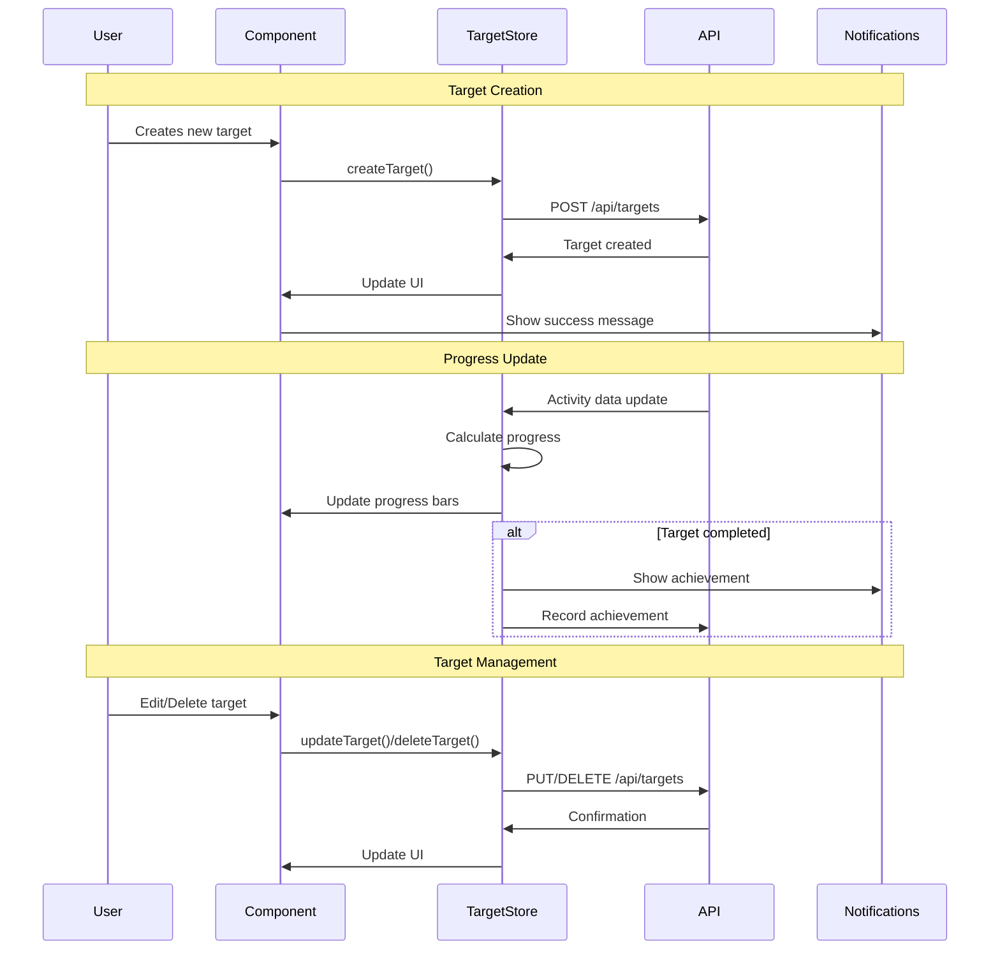

# GPS-005 Set and Track Fitness Targets - Implementation Planning

## User Story

As a fitness enthusiast, I want to set weekly and monthly fitness goals, so that I can work toward specific targets and measure my progress.

## Pre-conditions

- User authentication system is in place
- Activity tracking system is functional
- Basic navigation and routing structure exists
- Data persistence layer is available

## Design

### Visual Layout

The fitness targets feature will consist of:
- **Main Dashboard**: Overview of all active targets with progress indicators
- **Target Creation Form**: Modal/page for setting new targets
- **Target Detail View**: Detailed progress view with charts and statistics
- **Target History**: Historical view of completed targets for comparison
- **Progress Cards**: Visual cards showing current progress toward each target
- **Achievement Notifications**: Toast/modal notifications for completed targets

### Color and Typography

- **Background Colors**: 
  - Primary: bg-white dark:bg-gray-900
  - Secondary: bg-gray-50 dark:bg-gray-800
  - Success: bg-green-500 hover:bg-green-600
  - Progress: bg-blue-500 hover:bg-blue-600
  - Warning: bg-yellow-500 hover:bg-yellow-600

- **Typography**:
  - Headings: font-inter text-2xl font-semibold text-gray-900 dark:text-white
  - Subheadings: font-inter text-lg font-medium text-gray-700 dark:text-gray-200
  - Body: font-inter text-base text-gray-600 dark:text-gray-300
  - Metrics: font-mono text-xl font-bold text-blue-600 dark:text-blue-400

- **Component-Specific**:
  - Progress Cards: bg-white dark:bg-gray-800 shadow-md hover:shadow-lg border-l-4 border-blue-500
  - Target Buttons: bg-blue-500 text-white hover:bg-blue-600 active:bg-blue-700
  - Achievement Badge: bg-green-100 text-green-800 dark:bg-green-900 dark:text-green-200

### Interaction Patterns

- **Progress Bar Interaction**: 
  - Hover: Show exact progress percentage tooltip
  - Animation: Smooth fill animation on load
  - Color transition based on completion percentage
  - Accessibility: ARIA labels for screen readers

- **Target Card Interaction**:
  - Hover: Lift effect with shadow increase
  - Click: Navigate to detailed view with smooth transition
  - Progress animation: Animated progress bars on data update
  - Accessibility: Keyboard navigation support

### Measurements and Spacing

- **Container**:
  ```
  max-w-6xl mx-auto px-4 sm:px-6 lg:px-8
  ```

- **Component Spacing**:
  ```
  - Grid gap: gap-6 md:gap-8
  - Card padding: p-6 md:p-8
  - Section spacing: space-y-8
  - Progress bar height: h-3 md:h-4
  ```

### Responsive Behavior

- **Desktop (lg: 1024px+)**:
  ```
  - Grid: grid-cols-3 gap-8
  - Two-column detail view
  - Full charts and statistics
  ```

- **Tablet (md: 768px - 1023px)**:
  ```
  - Grid: grid-cols-2 gap-6
  - Stacked detail sections
  - Condensed chart views
  ```

- **Mobile (sm: < 768px)**:
  ```
  - Single column layout
  - Simplified card design
  - Minimal chart views
  - Touch-optimized interactions
  ```

## Technical Requirements

### Component Structure

```
src/app/targets/
├── page.tsx
├── create/
│   └── page.tsx
├── [targetId]/
│   └── page.tsx
└── _components/
    ├── TargetDashboard.tsx          # Main dashboard with target overview
    ├── TargetCard.tsx               # Individual target progress card
    ├── TargetCreationForm.tsx       # Form for creating new targets
    ├── TargetProgress.tsx           # Progress visualization component
    ├── TargetHistory.tsx            # Historical targets view
    ├── AchievementNotification.tsx  # Achievement notification component
    ├── ProgressChart.tsx            # Chart component for progress visualization
    └── useTargets.ts                # Custom hook for target management
```

### Required Components

- TargetDashboard ✅
- TargetCard ✅
- TargetCreationForm ✅
- TargetProgress ✅
- TargetHistory ✅
- AchievementNotification ✅
- ProgressChart ✅
- useTargets (Custom Hook) ✅

### State Management Requirements

```typescript
interface Target {
  id: string;
  userId: string;
  type: 'distance' | 'time' | 'activities' | 'steps' | 'calories';
  period: 'weekly' | 'monthly';
  targetValue: number;
  currentValue: number;
  unit: string;
  startDate: Date;
  endDate: Date;
  status: 'active' | 'completed' | 'failed' | 'paused';
  createdAt: Date;
  completedAt?: Date;
}

interface TargetState {
  // UI States
  isLoading: boolean;
  isCreating: boolean;
  showAchievement: boolean;
  activeFilter: 'all' | 'active' | 'completed';
  
  // Data States
  targets: Target[];
  selectedTarget: Target | null;
  achievements: Achievement[];
  
  // Form States
  createFormData: Partial<Target>;
  formErrors: Record<string, string>;
  isDirty: boolean;
}

// State Updates
const actions = {
  setLoading: (state: boolean) => void;
  createTarget: (target: Omit<Target, 'id' | 'createdAt'>) => void;
  updateTarget: (id: string, updates: Partial<Target>) => void;
  deleteTarget: (id: string) => void;
  updateProgress: (id: string, progress: number) => void;
  showAchievementNotification: (target: Target) => void;
  setFilter: (filter: string) => void;
}
```

## Acceptance Criteria

### Layout & Content

1. Target Dashboard Layout
   ```
   - Header with "Fitness Targets" title and "New Target" button
   - Filter tabs (All, Active, Completed)
   - Grid of target cards showing progress
   - Empty state when no targets exist
   ```

2. Target Card Layout
   ```
   - Target type icon and name
   - Progress bar with percentage
   - Current vs target values
   - Time remaining indicator
   - Quick action buttons (edit, pause, delete)
   ```

3. Target Creation Form
   ```
   - Target type selection (dropdown)
   - Period selection (weekly/monthly)
   - Target value input with unit
   - Start date picker
   - Save/Cancel buttons
   ```

### Functionality

1. Target Management

   - [x] User can create new targets with type, period, and value
   - [x] User can edit existing active targets
   - [x] User can pause/resume targets
   - [x] User can delete targets with confirmation

2. Progress Tracking

   - [x] Progress automatically updates from activity data (mock implementation)
   - [x] Visual progress bars show completion percentage
   - [x] Progress history is maintained and displayed
   - [x] Real-time updates when new activities are recorded (simulated)

3. Achievement System
   - [x] Notifications when targets are achieved
   - [x] Achievement badges and history tracking
   - [x] Celebration animations for completed targets
   - [x] Social sharing options for achievements

### Navigation Rules

- Main targets page accessible from navigation menu
- Target creation opens in modal or dedicated page
- Individual target details accessible by clicking cards
- Browser back button properly handles navigation
- Deep linking to specific targets supported

### Error Handling

- Form validation with clear error messages
- Network error handling with retry options
- Graceful degradation when data is unavailable
- Loading states for all async operations

## Modified Files

```
src/app/targets/
├── page.tsx ✅
├── create/
│   └── page.tsx ✅
├── [targetId]/
│   └── page.tsx ✅
└── _components/
    ├── TargetDashboard.tsx ✅
    ├── TargetCard.tsx ✅
    ├── TargetCreationForm.tsx ✅
    ├── TargetProgress.tsx ✅
    ├── TargetHistory.tsx ✅
    ├── AchievementNotification.tsx ✅
    ├── ProgressChart.tsx ✅
    └── useTargets.ts ✅
├── store/
│   └── targetStore.ts ✅
├── types/
│   └── target.ts ✅
├── utils/
│   └── targetCalculations.ts ✅
└── components/
    └── Navigation.tsx ✅
```

## Status

� COMPLETED

1. Setup & Configuration

   - [x] Create target types and interfaces
   - [x] Set up target store with Zustand
   - [x] Configure target routing structure
   - [x] Set up database schema for targets (mock implementation)

2. Layout Implementation

   - [x] Create main targets dashboard layout
   - [x] Implement responsive grid system
   - [x] Create target card component design
   - [x] Implement progress visualization components

3. Feature Implementation

   - [x] Build target creation form with validation
   - [x] Implement progress tracking logic
   - [x] Create achievement notification system
   - [x] Build target history and comparison features

4. Testing
   - [ ] Unit tests for target calculations
   - [ ] Integration tests for target CRUD operations
   - [ ] E2E tests for complete target lifecycle
   - [ ] Accessibility testing for all components

## Dependencies

- Activity tracking system (for progress updates)
- User authentication system
- Database/storage layer for target persistence
- Notification system for achievements

## Related Stories

- GPS-002 (Track GPS Data and Routes) - Activity data source
- GPS-003 (Monitor Heart Rate Data) - Additional metrics
- GPS-006 (Earn Achievement Badges) - Achievement system integration

## Notes

### Technical Considerations

1. Progress calculation should be efficient and real-time
2. Target periods should handle timezone considerations properly
3. Achievement notifications should not be intrusive
4. Data should be cached locally for offline access
5. Progress updates should be optimistic with fallback

### Business Requirements

- Support for multiple target types (distance, time, activities, steps, calories)
- Flexible period options (weekly, monthly)
- Historical data preservation for comparison
- Achievement system to drive engagement

### API Integration

#### Type Definitions

```typescript
interface Target {
  id: string;
  userId: string;
  type: 'distance' | 'time' | 'activities' | 'steps' | 'calories';
  period: 'weekly' | 'monthly';
  targetValue: number;
  currentValue: number;
  unit: string;
  startDate: Date;
  endDate: Date;
  status: 'active' | 'completed' | 'failed' | 'paused';
  createdAt: Date;
  completedAt?: Date;
}

interface Achievement {
  id: string;
  targetId: string;
  userId: string;
  achievedAt: Date;
  type: string;
  value: number;
  celebrated: boolean;
}

interface TargetProgress {
  targetId: string;
  date: Date;
  value: number;
  percentage: number;
}

interface TargetStore {
  targets: Target[];
  achievements: Achievement[];
  isLoading: boolean;
  error: string | null;
  
  // Actions
  fetchTargets: () => Promise<void>;
  createTarget: (target: Omit<Target, 'id' | 'createdAt'>) => Promise<void>;
  updateTarget: (id: string, updates: Partial<Target>) => Promise<void>;
  deleteTarget: (id: string) => Promise<void>;
  updateProgress: (id: string, progress: number) => Promise<void>;
}
```

### Mock Implementation

#### Mock Server Configuration

```typescript
// filepath: mocks/stub.ts
const mocks = [
  {
    endPoint: '/api/targets',
    json: 'targets.json',
  },
  {
    endPoint: '/api/targets/progress',
    json: 'target-progress.json',
  },
  {
    endPoint: '/api/achievements',
    json: 'achievements.json',
  },
];
```

#### Mock Response

```json
// filepath: mocks/responses/targets.json
{
  "status": "SUCCESS",
  "data": {
    "targets": [
      {
        "id": "target-1",
        "userId": "user-123",
        "type": "distance",
        "period": "weekly",
        "targetValue": 50,
        "currentValue": 32.5,
        "unit": "km",
        "startDate": "2025-09-30T00:00:00.000Z",
        "endDate": "2025-10-06T23:59:59.999Z",
        "status": "active",
        "createdAt": "2025-09-30T10:00:00.000Z"
      },
      {
        "id": "target-2",
        "userId": "user-123",
        "type": "activities",
        "period": "monthly",
        "targetValue": 20,
        "currentValue": 15,
        "unit": "activities",
        "startDate": "2025-10-01T00:00:00.000Z",
        "endDate": "2025-10-31T23:59:59.999Z",
        "status": "active",
        "createdAt": "2025-10-01T08:00:00.000Z"
      }
    ]
  }
}
```

### State Management Flow



### Custom Hook Implementation

```typescript
const useTargets = () => {
  const store = useTargetStore();
  const [localProgress, setLocalProgress] = useState<Record<string, number>>({});

  useEffect(() => {
    // Fetch initial targets
    store.fetchTargets();
    
    // Set up real-time progress updates
    const progressInterval = setInterval(() => {
      store.targets.forEach(target => {
        if (target.status === 'active') {
          // Calculate current progress from activities
          calculateCurrentProgress(target.id).then(progress => {
            if (progress !== target.currentValue) {
              store.updateProgress(target.id, progress);
            }
          });
        }
      });
    }, 30000); // Update every 30 seconds

    return () => clearInterval(progressInterval);
  }, []);

  const createTarget = useCallback(async (targetData: Omit<Target, 'id' | 'createdAt'>) => {
    try {
      await store.createTarget(targetData);
      toast.success('Target created successfully!');
    } catch (error) {
      toast.error('Failed to create target');
    }
  }, [store]);

  const calculateProgress = useCallback((target: Target) => {
    return Math.min((target.currentValue / target.targetValue) * 100, 100);
  }, []);

  const getTimeRemaining = useCallback((target: Target) => {
    const now = new Date();
    const timeLeft = target.endDate.getTime() - now.getTime();
    const daysLeft = Math.ceil(timeLeft / (1000 * 60 * 60 * 24));
    return daysLeft;
  }, []);

  return {
    ...store,
    createTarget,
    calculateProgress,
    getTimeRemaining,
    localProgress,
  };
};
```

## Testing Requirements

### Integration Tests (Target: 80% Coverage)

1. Target CRUD Operations

```typescript
describe('Target Management', () => {
  it('should create a new target with valid data', async () => {
    const targetData = {
      type: 'distance',
      period: 'weekly',
      targetValue: 50,
      unit: 'km'
    };
    await createTarget(targetData);
    expect(store.targets).toContainEqual(expect.objectContaining(targetData));
  });

  it('should update target progress when activities are recorded', async () => {
    const target = createMockTarget();
    await recordActivity({ distance: 10, targetId: target.id });
    expect(target.currentValue).toBe(10);
  });

  it('should trigger achievement when target is completed', async () => {
    const target = createMockTarget({ targetValue: 50, currentValue: 45 });
    await updateProgress(target.id, 50);
    expect(mockNotifications.achievement).toHaveBeenCalled();
  });
});
```

2. Progress Calculation Tests

```typescript
describe('Progress Calculations', () => {
  it('should calculate correct progress percentage', async () => {
    const target = { targetValue: 100, currentValue: 25 };
    const progress = calculateProgress(target);
    expect(progress).toBe(25);
  });

  it('should handle weekly period calculations correctly', async () => {
    const weeklyTarget = createWeeklyTarget();
    const activities = getWeekActivities();
    const progress = calculateWeeklyProgress(weeklyTarget, activities);
    expect(progress).toBeGreaterThanOrEqual(0);
  });
});
```

3. Edge Cases

```typescript
describe('Edge Cases', () => {
  it('should handle targets with zero progress gracefully', async () => {
    const target = createMockTarget({ currentValue: 0 });
    const component = render(<TargetCard target={target} />);
    expect(component.getByText('0%')).toBeInTheDocument();
  });

  it('should handle exceeded targets appropriately', async () => {
    const target = createMockTarget({ targetValue: 50, currentValue: 75 });
    const progress = calculateProgress(target);
    expect(progress).toBe(100); // Cap at 100%
  });
});
```

### Performance Tests

1. Progress Update Performance

```typescript
describe('Performance', () => {
  it('should handle multiple target updates efficiently', async () => {
    const targets = createMultipleTargets(100);
    const startTime = performance.now();
    await updateMultipleTargetProgress(targets);
    const endTime = performance.now();
    expect(endTime - startTime).toBeLessThan(1000); // Under 1 second
  });
});
```

### Accessibility Tests

```typescript
describe('Accessibility', () => {
  it('should provide proper ARIA labels for progress bars', async () => {
    const target = createMockTarget();
    const component = render(<TargetProgress target={target} />);
    const progressBar = component.getByRole('progressbar');
    expect(progressBar).toHaveAttribute('aria-valuenow');
    expect(progressBar).toHaveAttribute('aria-valuemax');
  });

  it('should support keyboard navigation for target cards', async () => {
    const targets = [createMockTarget(), createMockTarget()];
    const component = render(<TargetDashboard targets={targets} />);
    const cards = component.getAllByRole('button');
    cards[0].focus();
    fireEvent.keyDown(cards[0], { key: 'Tab' });
    expect(cards[1]).toHaveFocus();
  });
});
```